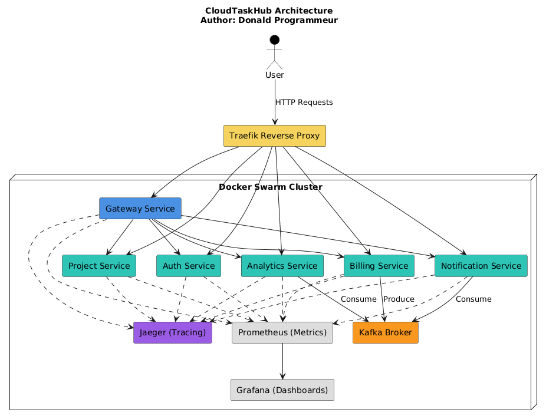
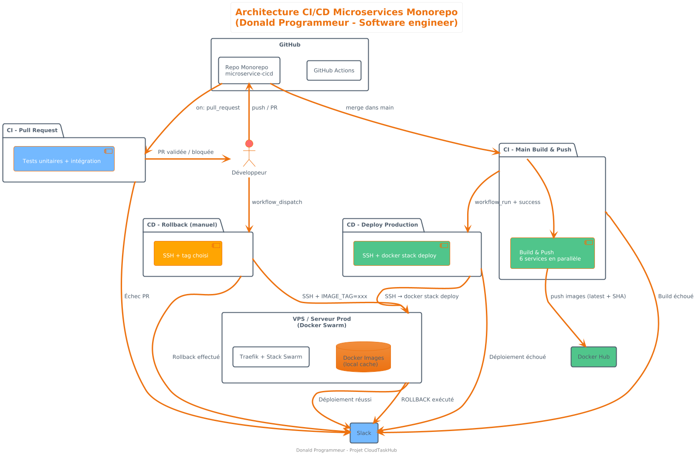

# 🌐 CloudTaskHub – Microservices & DevOps Architecture



# Architecture de Déploiement



CloudTaskHub est une architecture microservices complète construite avec FastAPI, Kafka, Docker Swarm, Traefik, OpenTelemetry, Jaeger, Prometheus, Grafana et un pipeline CI/CD GitHub Actions production-ready.

Ce projet illustre les bonnes pratiques DevOps modernes, le déploiement distribué, l'observabilité complète, l'intégration continue, le déploiement continu, l'orchestration Swarm, et la communication inter-services.

---

## 🏗️ Architecture Globale

### 🎯 Services applicatifs
- **Gateway Service**
- **Auth Service**
- **Project Service**
- **Billing Service**
- **Notification Service**
- **Analytics Service**

### ⚙️ Middleware & Infrastructure
- **Traefik** → Reverse proxy + routing dynamique
- **Kafka** (Bitnami) → Messaging Event-Driven
- **Jaeger** → Distributed Tracing
- **Prometheus** → Metrics
- **Grafana** → Dashboards
- **Docker Swarm** → Orchestration & Rolling Deployments

---

## 📦 Prérequis

### ✔ Docker 20+
### ✔ Docker Compose v2
### ✔ Docker Swarm initialisé :
```bash
docker swarm init
````

### ✔ Création du réseau Traefik global :

```bash
docker network create --driver=overlay traefik-public
```

### ✔ Fichier ACME pour TLS (optionnel)

```bash
touch acme.json
chmod 600 acme.json
```

---

## 📁 Structure du projet

```
cloudtaskhub/
│
├── services/
│   ├── gateway/
│   ├── auth/
│   ├── billing/
│   ├── notification/
│   ├── project/
│   └── analytics/
│
├── docker-compose.yml      # Production Swarm
├── docker-compose.tests.yml
├── Makefile                # Automatisation DevOps
├── prometheus.yml
├── acme.json
└── .github/workflows/
    ├── ci-pr.yml
    ├── ci-main.yml
    ├── cd-deploy.yml
    └── cd-rollback.yml
```

---

# 🚀 Déploiement en Production (Docker Swarm)

CloudTaskHub utilise Docker Swarm pour un déploiement HA, scalable, sécurisé via Traefik.

## 1️⃣ Configurer la version à déployer

Dans l'environnement :

Voir les variables cicd dans docs/github-secrets.md 

pour setup le vps voir docs/vps-setup.md


## 2️⃣ Déployer la stack (Docker Swarm) en local

```bash
docker stack deploy -c docker-compose.yml cloudtaskhub
```

## 3️⃣ Vérifier l’état

```bash
docker stack services cloudtaskhub
docker service logs cloudtaskhub_gateway-service -f
```

---

# 🌐 Routage Traefik

Après déploiement, ajoute ceci dans `/etc/hosts` :

```
127.0.0.1 gateway.localhost
127.0.0.1 auth.localhost
127.0.0.1 project.localhost
127.0.0.1 billing.localhost
127.0.0.1 notification.localhost
127.0.0.1 analytics.localhost
```

### Accès :
* Gateway → [http://gateway.localhost](http://gateway.localhost)
* Auth → [http://auth.localhost](http://auth.localhost)
* Monitoring → [http://localhost:3000](http://localhost:3000)
* Prometheus → [http://localhost:9090](http://localhost:9090)
* Jaeger → [http://localhost:16686](http://localhost:16686)

---

# 🧪 Tests

## 1️⃣ Tests unitaires

```bash
make test
```

## 2️⃣ Tests d’intégration microservices

```bash
docker compose -f docker-compose.tests.yml up --build --abort-on-container-exit
docker compose -f docker-compose.tests.yml down -v
```

---

# 🤖 CI/CD GitHub Actions

La pipeline CI/CD inclut :

### ✔ Sur Pull Request :

* Lint
* Tests unitaires
* Tests d’intégration
* Notifications Slack si échec

### ✔ Sur merge dans main :

* Build des images Docker
* Scan sécurité (Trivy)
* Push Docker Hub (tag + latest)
* Déclenche le CD automatique

### ✔ Déploiement (cd-deploy.yml) :

* Pull les images versionnées
* Mise à jour `.env` côté serveur
* Déploiement Swarm automatique
* Notifications Slack

### ✔ Rollback en un clic :

Dans GitHub → Actions → CD - Rollback

---

# 🔧 Commandes Makefile (Professionnel)

| Commande                   | Description                     |
| -------------------------- | ------------------------------- |
| `make build`               | Build toutes les images         |
| `make build-one SERVICE=x` | Build un seul microservice      |
| `make push`                | Push Docker Hub                 |
| `make test`                | Tests unitaires                 |
| `make integration`         | Tests d’intégration             |
| `make deploy TAG=x`        | Déployer une version spécifique |
| `make rollback TAG=x`      | Revenir en arrière              |
| `make scan`                | Scan Trivy des images           |
| `make clean`               | Nettoyage Docker                |

---

# 🔎 Observabilité

## Traces distribuées

Accessible via Jaeger :

👉 [http://localhost:16686](http://localhost:16686)
Tu peux suivre :

* les appels gateway → auth → project
* les événements Kafka
* les temps de réponses
* les erreurs

## Metrics Prometheus

[http://localhost:9090](http://localhost:9090)

## Dashboards Grafana

[http://localhost:3000](http://localhost:3000)
(identifiants par défaut : `admin / admin`)

---

# ⚠️ Sécurité

* Tous les services tournent en user non-root
* Les images sont scannées automatiquement (Trivy)
* Les communications internes passent par un réseau overlay
* Traefik expose uniquement les services déclarés en labels
* Possibilité d’activer TLS Let's Encrypt

---

# 🎯 Objectifs pédagogiques

Ce projet illustre :

* Microservices Event-Driven Architecture
* DevOps CI/CD complet (tests, sécurité, déploiement)
* Orchestration haute disponibilité avec Docker Swarm
* Observabilité distribuée (OpenTelemetry)
* Monitoring avancé (Prometheus + Grafana)
* Reverse proxy Traefik
* Kafka stream messaging
* Blue/Green & Rollback-friendly architecture

---

# 📞 Support / Questions

Pour toute amélioration ou ajout :

* ouvrir une Pull Request
* proposer un nouveau microservice via issue GitHub

---

# 🏁 Conclusion

CloudTaskHub est un modèle professionnel pour :

* apprendre le DevOps moderne
* construire un portfolio solide
* préparer une certification DevOps
* travailler en équipe sur une architecture scalable


# LINTERS – CODE FORMATTER

1️⃣ Installer pre-commit :

```bash
pip install pre-commit
```

2️⃣ Installer les hooks :

```bash
pre-commit install
```

Tu verras un message :
```bash
pre-commit installed at .git/hooks/pre-commit
```

3️⃣ Tester tous les hooks sur tout le projet :

```bash
pre-commit run --all-files
```

🎁 Ce que ça fait dans ta vie réelle DevOps

✔ Avant chaque git commit,
→ Ruff vérifie le code
→ Black reformate
→ Isort trie les imports
→ Mypy valide les types
→ Detect-secrets empêche de commit un token AWS, clé privée, etc.
→ Yamllint vérifie tes fichiers CI/CD

Si un hook échoue → le commit est bloqué, et tu corriges avant de pousser un code cassé.

